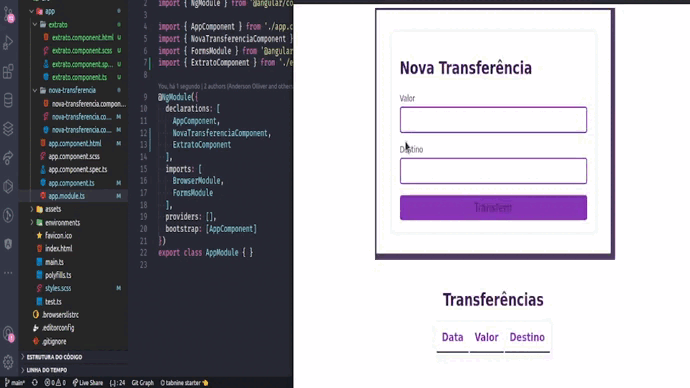

# Funcionalidades banco digital usando Angular

Meu primeirto projeto é sobre fazer tranferência online, onde pode colocar o valor e o destino(conta de quem deseja enviar a transferência) após apertar o botão **Tranferir** aparece a transferência com a data e horário, valor da tranferência e a conta destino.

>..Este projeto foi gerado com [Angular CLI](https://github.com/angular/angular-cli) version 10.1.6.

## Servidor de desenvolvimento

> Execute `ng serve` para um servidor dev. Navegue até `http://localhost:4200/`. O aplicativo será recarregado automaticamente se você alterar qualquer um dos arquivos de origem.

## Para ajuda

>Para obter mais ajuda na CLI do Angular, use `ng help` ou confira o [Angular CLI README](https://github.com/angular/angular-cli/blob/master/README.md).
